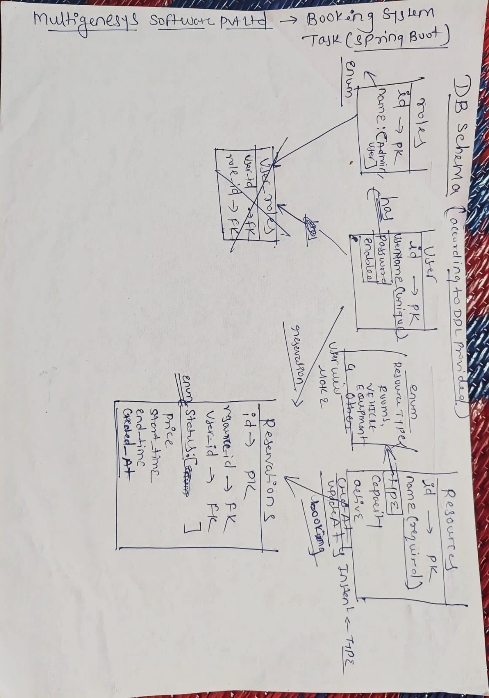

# Booking System API
Read this documentation carefully. Understand project Features and
setup Process. Follow the instruction provided in documentation

A Spring Boot–based **Booking System** application with authentication, resource management, and Swagger API documentation.

##  Features
- User Authentication (Register & Login with JWT)
- Admin Resource Management (CRUD operations with pagination)
- Role-based Access Control (Admin/User)
- Reservation System
    - Create, view, cancel, and delete reservations
    - Role-based access: Admin vs. User
    - Filtering via request body (status, price range)
    - Overlap prevention for CONFIRMED reservations
- Exception Handling (custom exceptions for better error messages)
- Pagination support for resource and reservation listings
- Swagger/OpenAPI Documentation

---

## Tech Stack
- **Backend:** Spring Boot 3.x, Spring Security, Spring Data JPA
- **Database:** PostgreSQL 
- **Auth:** JWT (JSON Web Tokens) stored in HttpOnly cookies
- **API Docs:** Springdoc OpenAPI (Swagger UI)
- **Build Tool:** Maven
- **Java Version:** 21

---

## Database Structure



---
## Installation & Setup

### 1. Clone the repository
```bash
git clone https://github.com/Abhijeet2242/Booking-System.git

cd booking-system
```
### 2. Configure Database
No need to do it, as I set up this in application.properties. Still for understanding I am providing
```bash
spring.application.name=booking-system

# PostgreSQL connection
spring.datasource.url=jdbc:postgresql://localhost:5432/booking-system-db
spring.datasource.username=postgres
spring.datasource.password=root
spring.datasource.driver-class-name=org.postgresql.Driver

# JPA & Hibernate
spring.jpa.hibernate.ddl-auto=update
spring.jpa.show-sql=true

spring.sql.init.mode=always
spring.sql.init.platform=postgres

server.port=4000
```
### 3. Run Application in Intellij

---
### API Documentation

Swagger UI is enabled. After running the project, visit:
```bash
🔗 http://localhost:4000/swagger-ui/index.html
````
OpenAPI JSON spec:
```bash
🔗 http://localhost:4000/v3/api-docs
```
Postman API collection for API
```bash
https://www.postman.com/abhi2242/multigenesys/collection/91dx8k5/booking-system
```
Keep in mind 
1. First hit Register
2. Then login it will store token in cookies as well as in
return also for identifying its works fine
3. then use different routes
---

